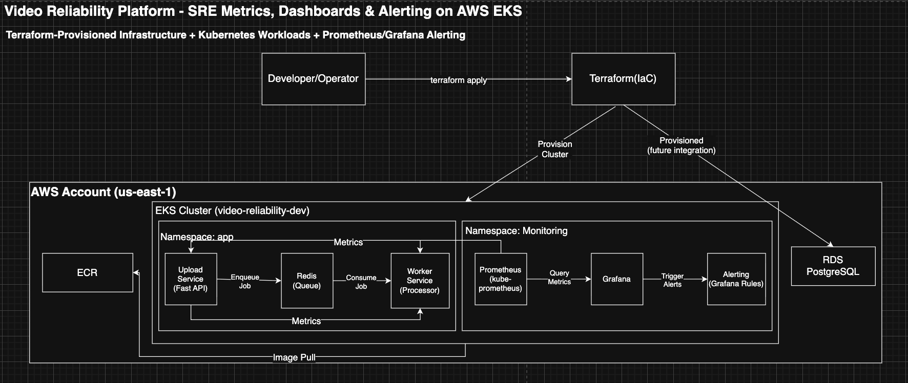

# Global Video Reliability Platform — EKS + Observability + RDS (Terraform)

## 1) Project Overview

This project demonstrates a production-style reliability workflow for a simplified video background-processing pipeline deployed on **AWS EKS** and instrumented with **Prometheus + Grafana**.

Instead of focusing only on “running services,” the emphasis is on **SRE-style validation**:
- confirming the system is healthy (pods/services)
- proving end-to-end job processing works
- scraping and querying metrics
- visualizing behavior in Grafana dashboards
- triggering alerts for abnormal conditions (stall + traffic spikes)

---

## 2) Problem Statement

Large-scale video platforms (uploads, transcodes, metadata extraction) rely heavily on **asynchronous background jobs**. Under traffic spikes:
- queues can grow fast
- workers can stall or fall behind
- failures may not be visible without observability

This project shows how to:
- run the workload on Kubernetes (EKS)
- expose application metrics
- scrape metrics automatically (ServiceMonitor)
- build dashboards for visibility
- configure alert rules based on real traffic patterns

---

## 3) Architecture

Key components:
- **Terraform (IaC)**: provisions AWS infrastructure
- **EKS Cluster**: runs application + monitoring namespaces
- **ECR**: stores container images for workloads
- **RDS PostgreSQL**: provisioned database (marked as future integration in the architecture)
- **Namespace: app**: upload-service, worker-service, redis
- **Namespace: monitoring**: kube-prometheus-stack (Prometheus + Grafana)
- **Grafana Alerting**: rules for stall + spike detection

---

## 4) Tech Stack

- **AWS**: EKS, ECR, RDS (PostgreSQL), VPC/IAM via Terraform  
- **Terraform**: infrastructure provisioning  
- **Kubernetes + Helm**: deployments and monitoring stack  
- **Python (FastAPI)**: upload-service  
- **Python Worker**: background processor  
- **Redis**: queue backend  
- **Prometheus Operator (kube-prometheus-stack)**: metrics scraping + ServiceMonitors  
- **Grafana**: dashboards + alert rules  
